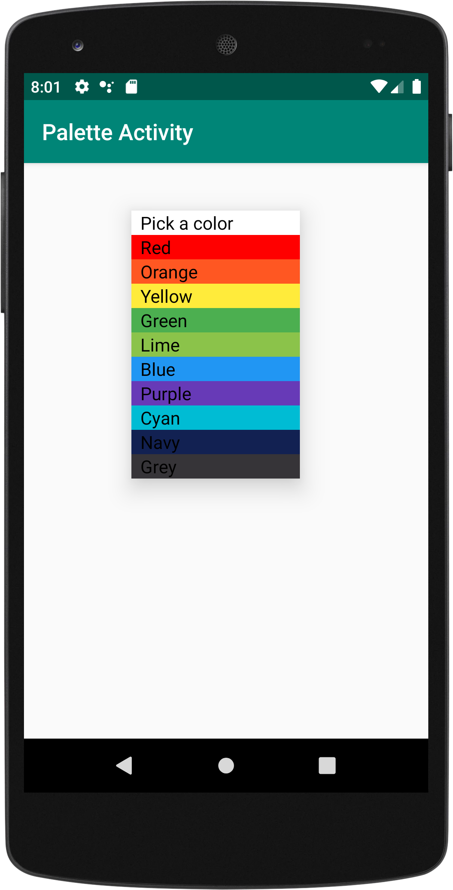
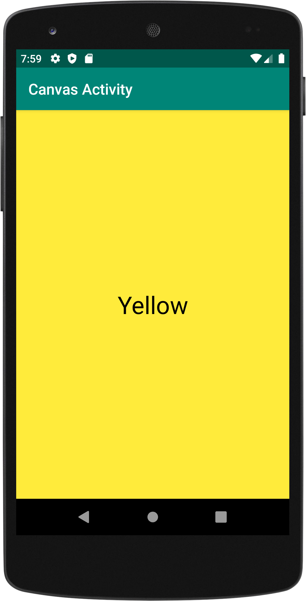
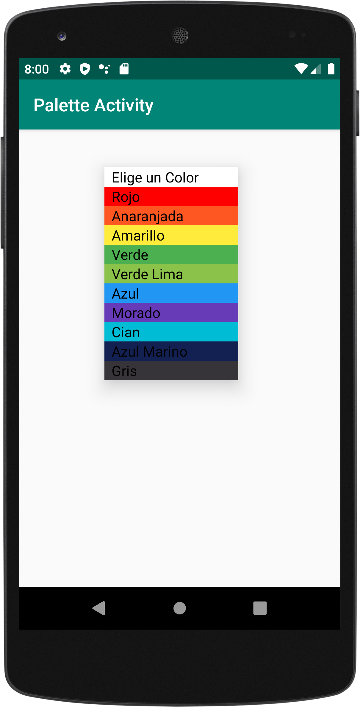
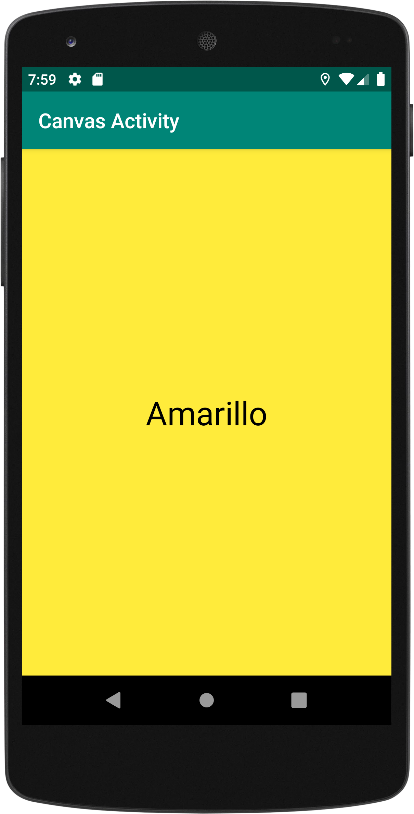

# Color Activity - Using Multiple Languages

CIS 3515 Introduction to Mobile Application Development - Assignment 5

This Android application is the same as the Assignment 4, Color Activity - Part 2 (Using Multiple Activities), but 
with an added feature. Now the applications adds localization with a Spanish translation. 

Current Features of Application:
This Android application is a 2-activity application along with a custom adapter. The application allows the user to 
select a color from a Spinner on one activity, and once selected, launch the second activity and set the background 
of the new activity’s layout to the selected color. The first activity is called Pallete Activity and the second 
activity is called Canvas Activity (this is the new activity that opens when a color is selected as shown in image 
1 & 2 below). The application also has a custom icon (the black and white icon shown in the third image) that I made
and a signed APK has been generate that is ready to be distributed.

New Feature:
Now the application can be translated into Spanish if the user would like. To do this, the user can go to Settings ->
System -> Languages & input -> Languages -> and drag Espanol at the number 1 position with English being the second.
Once the user does this and goes back to the application, the Spinner will display all color names in Spanish. Also if
the user selects a color, a new activity (Canvas Activity) will open with the name of the selected color translated in
Spanish. * Note: If these steps are not followed, the application will display all text in English as default. Images of both
default and Spanish translation are shown below.
 
 
     
